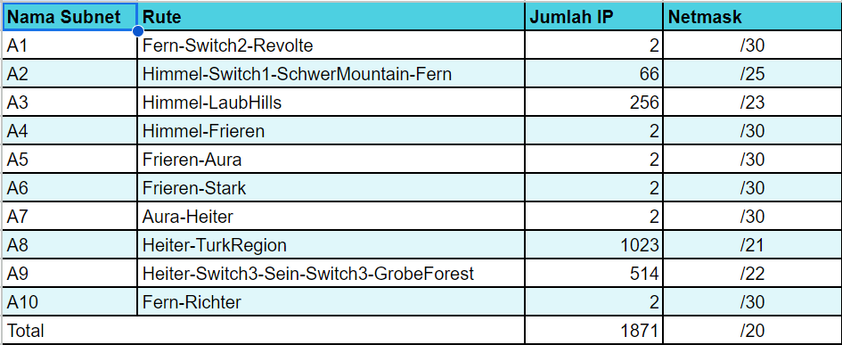

# Jarkom-Modul-5-E23-2023

Praktikum Jaringan Komputer Modul 5 Tahun 2023

## KELOMPOK E23 
Ilham Insan Wafi (5025211255)

## LAPORAN RESMI

### Prefix IP
Prefix IP : 10.48.x.x

### Rute


### Pembagian IP


### Subnetting
Berikut merupakan subneeting yang telah kami sesuaikan dengan IP yang telah didapatkan.
- Revolte
```
auto eth0
iface eth0 inet static
	address 10.48.0.2
	netmask 255.255.255.252
  gateway 10.48.0.1
  up echo nameserver 10.48.0.1 > /etc/resolv.conf
```
- Richter
```
auto eth0
iface eth0 inet static
	address 10.48.0.22
	netmask 255.255.255.252
        gateway 10.48.0.21
        up echo nameserver 10.48.0.21 > /etc/resolv.conf
```
- Fern
```
auto eth0
iface eth0 inet static
	address 10.48.0.130
	netmask 255.255.255.128
        gateway 10.48.0.129
        up echo nameserver 10.48.0.129 > /etc/resolv.conf

auto eth1
iface eth1 inet static
	address 10.48.0.1
	netmask 255.255.255.252

auto eth2
iface eth2 inet static
	address 10.48.0.21
	netmask 255.255.255.252
```
- Himmel
```
auto eth0
iface eth0 inet static
	address 10.48.0.6
	netmask 255.255.255.252
        gateway 10.48.0.5
        up echo nameserver 10.48.0.5 > /etc/resolv.conf

auto eth1
iface eth1 inet static
	address 10.48.0.129
	netmask 255.255.255.128

auto eth2
iface eth2 inet static
	address 10.48.2.1
	netmask 255.255.254.0
```
- Frieren
```
auto eth0
iface eth0 inet static
	address 10.48.0.10
	netmask 255.255.255.252
        gateway 10.48.0.9
        up echo nameserver 10.48.0.9 > /etc/resolv.conf

auto eth1
iface eth1 inet static
	address 10.48.0.5
	netmask 255.255.255.252

auto eth2
iface eth2 inet static
	address 10.48.0.13
	netmask 255.255.255.252
```
- Aura
```
auto eth0
iface eth0 inet dhcp

auto eth1
iface eth1 inet static
	address 10.48.0.17
	netmask 255.255.255.252

auto eth2
iface eth2 inet static
	address 10.48.0.9
	netmask 255.255.255.252
```
- Heiter
```
auto eth0
iface eth0 inet static
	address 10.48.0.18
	netmask 255.255.255.252
        gateway 10.48.0.17
        up echo nameserver 10.48.0.17 > /etc/resolv.conf

auto eth1
iface eth1 inet static
	address 10.48.4.1
	netmask 255.255.252.0

auto eth2
iface eth2 inet static
	address 10.48.8.1
	netmask 255.255.248.0
```
- Stark
```
auto eth0
iface eth0 inet static
	address 10.48.0.14
	netmask 255.255.255.252
        gateway 10.48.0.13
        up echo nameserver 10.48.0.13 > /etc/resolv.conf
```
- Sein
```
auto eth0
iface eth0 inet static
	address 10.48.4.2
	netmask 255.255.252.0
        gateway 10.48.4.1
        up echo nameserver 10.48.4.1 > /etc/resolv.conf
```
- Client
```
auto eth0
iface eth0 inet dhcp
```

### Routing
Setelah melakukan subnetting pada setiap node. Sekarang kami akan beralih pada setup routing sebagai berikut.
- Aura
```
route add -net 10.48.8.0 netmask 255.255.248.0 gw 10.48.0.18
route add -net 10.48.4.0 netmask 255.255.252.0 gw 10.48.0.18
route add -net 10.48.0.12 netmask 255.255.255.252 gw 10.48.0.10
route add -net 10.48.0.4 netmask 255.255.255.252 gw 10.48.0.10
route add -net 10.48.2.0 netmask 255.255.254.0 gw 10.48.0.10
route add -net 10.48.0.128 netmask 255.255.255.128 gw 10.48.0.10
route add -net 10.48.0.20 netmask 255.255.255.252 gw 10.48.0.10
route add -net 10.48.0.0 netmask 255.255.255.252 gw 10.48.0.10
```
- Heiter
```
route add -net 10.48.0.8 netmask 255.255.255.252 gw 10.48.0.17
route add -net 10.48.0.12 netmask 255.255.255.252 gw 10.48.0.17
route add -net 10.48.0.4 netmask 255.255.255.252 gw 10.48.0.17
route add -net 10.48.2.0 netmask 255.255.254.0 gw 10.48.0.17
route add -net 10.48.0.128 netmask 255.255.255.128 gw 10.48.0.17
route add -net 10.48.0.20 netmask 255.255.255.252 gw 10.48.0.17
route add -net 10.48.0.0 netmask 255.255.255.252 gw 10.48.0.17
route add -net 0.0.0.0 netmask 0.0.0.0 gw 10.48.0.17
```
- Frieren
```
route add -net 10.48.2.0 netmask 255.255.254.0 gw 10.48.0.6
route add -net 10.48.0.128 netmask 255.255.255.128 gw 10.48.0.6
route add -net 10.48.0.20 netmask 255.255.255.252 gw 10.48.0.6
route add -net 10.48.0.0 netmask 255.255.255.252 gw 10.48.0.6
route add -net 0.0.0.0 netmask 0.0.0.0 gw 10.48.0.9
```
- Himmel
```
route add -net 10.48.0.20 netmask 255.255.255.252 gw 10.48.0.130
route add -net 10.48.0.0 netmask 255.255.255.252 gw 10.48.0.130
route add -net 0.0.0.0 netmask 0.0.0.0 gw 10.48.0.5
```
- Fern
```
route add -net 0.0.0.0 netmask 0.0.0.0 gw 10.48.0.129
```

### DNS SERVER
Disini yang bertindak sebagai DNS Server adalah router Richter dan akan dilakukan konfigurasi sebagai berikut
```
echo 'nameserver 192.168.122.1' >/etc/resolv.conf

apt update
apt install netcat -y
apt install bind9 -y

echo '
options {
  directory "/var/cache/bind";
  forwarders {
    192.168.122.1;
  };
  allow-query {any;};
  auth-nxdomain no; # conform to RFC1035
  listen-on-v6 {any;};
}' > /etc/bind/named.conf.options 

service bind9 restart
```

### DHCP Server
Berikut merupakan konfigurasi pada DHCP Server
```
option domain-name "example.org";
option domain-name-servers ns1.example.org, ns2.example.org;

default-lease-time 600;
max-lease-time 7200;

ddns-update-style none;

subnet 10.48.0.0 netmask 255.255.255.252 {
}

subnet 10.48.0.128 netmask 255.255.255.128 {
    range 10.48.0.131 10.48.0.254;
    option routers 10.48.0.129;
    option broadcast-address 10.48.0.255;
    option domain-name-servers 10.48.0.22;
    default-lease-time 180;
    max-lease-time 5760;
}

subnet 10.48.2.0 netmask 255.255.254.0 {
    range 10.48.2.2 10.48.3.254;
    option routers 10.48.2.1;
    option broadcast-address 10.48.3.255;
    option domain-name-servers 10.48.0.22;
    default-lease-time 180;
    max-lease-time 5760;
}

subnet 10.48.8.0 netmask 255.255.248.0 {
    range 10.48.8.2 10.48.15.254;
    option routers 10.48.8.1;
    option broadcast-address 10.48.15.255;
    option domain-name-servers 10.48.0.22;
    default-lease-time 180;
    max-lease-time 5760;
}

subnet 10.48.4.0 netmask 255.255.252.0 {
    range 10.48.4.3 10.48.7.254;
    option routers 10.48.4.1;
    option broadcast-address 10.48.7.255;
    option domain-name-servers 10.48.0.22;
    default-lease-time 180;
    max-lease-time 5760;
}
```
### DHCP Relay
Lakukan Konfig pada DHCP Relay :
```
# Configuration DHCP Relay
apt-get update
apt-get install isc-dhcp-relay -y

echo '
SERVERS="10.48.0.2"
INTERFACES="eth0 eth1 eth2"
OPTIONS="-m replace"
' >  /etc/default/isc-dhcp-relay

echo '
net.ipv4.ip_forward=1
' >  /etc/sysctl.conf
```

### SOAL 1
Agar topologi yang kalian buat dapat mengakses keluar, kalian diminta untuk mengkonfigurasi Aura menggunakan iptables, tetapi tidak ingin menggunakan MASQUERADE.
```
iptables -t nat -A POSTROUTING -s 10.15.0.0/20 -o eth0 -j SNAT --to-source 192.168.122.1
ETH0_IP=$(ip -4 addr show eth0 | grep inet | awk '{ print substr( $2, 1, length($2)-3 ) }')
```

### SOAL 2
Kalian diminta untuk melakukan drop semua TCP dan UDP kecuali port 8080 pada TCP.
```
# Bersihkan semua aturan yang ada jika diperlukan
iptables -F
# Izinkan koneksi yang masuk pada port 8080 TCP
iptables -A INPUT -p tcp --dport 8080 -j ACCEPT

# Jatuhkan semua koneksi TCP yang tidak menuju ke port 8080
iptables -A INPUT -p tcp ! --dport 8080 -j DROP

# Jatuhkan semua koneksi UDP
iptables -A INPUT -p udp -j DROP
```

### SOAL 3
```
iptables -A INPUT -m state --state ESTABLISHED,RELATED -j ACCEPT
iptables -A INPUT -p icmp -m connlimit --connlimit-above 3 --connlimit-mask 0 -j DROP
```

### SOAL 4
Stark :
```
iptables -A INPUT -p tcp --dport 22 -s 10.48.4.5 -j ACCEPT
iptables -A INPUT -p tcp --dport 22 -j DROP
```
Sein :
```
iptables -A INPUT -p tcp --dport 22 -s 10.48.4.5 -j ACCEPT
iptables -A INPUT -p tcp --dport 22 -j DROP
```

# SOAL 5
Selain itu, akses menuju WebServer hanya diperbolehkan saat jam kerja yaitu Senin-Jumat pada pukul 08.00-16.00.
```
iptables -A INPUT -m time --timestart 08:00 --timestop 16:00 --weekdays Mon,Tue,Wed,Thu,Fri -j ACCEPT
iptables -A INPUT -j REJECT
```

# SOAL 6
Lalu, karena ternyata terdapat beberapa waktu di mana network administrator dari WebServer tidak bisa stand by, sehingga perlu ditambahkan rule bahwa akses pada hari Senin - Kamis pada jam 12.00 - 13.00 dilarang (istirahat maksi cuy) dan akses di hari Jumat pada jam 11.00 - 13.00 juga dilarang (maklum, Jumatan rek).
```
iptables -I INPUT 3 -m time --timestart 12:00 --timestop 13:00 --weekdays Mon,Tue,Wed,Thu -j REJECT
iptables -I INPUT 4 -m time --timestart 11:00 --timestop 13:00 --weekdays Fri -j REJECT
```

# SOAL 7

