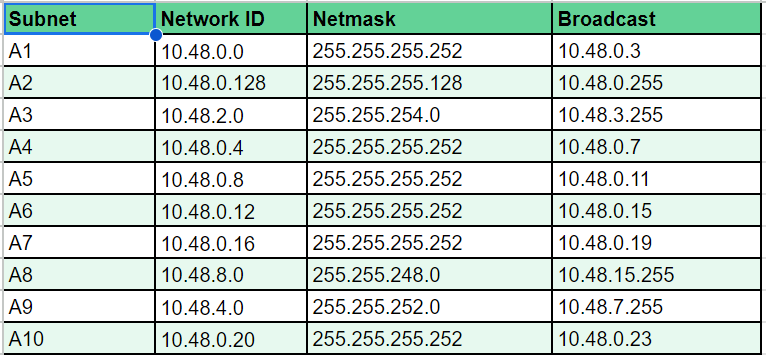

# Jarkom-Modul-5-E23-2023

Praktikum Jaringan Komputer Modul 5 Tahun 2023

## KELOMPOK E23 
Ilham Insan Wafi (5025211255)

## LAPORAN RESMI

### Topologi GNS & Pembagian Subnet VLSM


### Prefix IP
Prefix IP : 10.48.x.x

### Rute


### Pembagian IP


### Subnetting
Berikut merupakan subneeting yang telah kami sesuaikan dengan IP yang telah didapatkan.
- Revolte
```
auto eth0
iface eth0 inet static
	address 10.48.0.2
	netmask 255.255.255.252
  gateway 10.48.0.1
  up echo nameserver 10.48.0.1 > /etc/resolv.conf
```
- Richter
```
auto eth0
iface eth0 inet static
	address 10.48.0.22
	netmask 255.255.255.252
        gateway 10.48.0.21
        up echo nameserver 10.48.0.21 > /etc/resolv.conf
```
- Fern
```
auto eth0
iface eth0 inet static
	address 10.48.0.130
	netmask 255.255.255.128
        gateway 10.48.0.129
        up echo nameserver 10.48.0.129 > /etc/resolv.conf

auto eth1
iface eth1 inet static
	address 10.48.0.1
	netmask 255.255.255.252

auto eth2
iface eth2 inet static
	address 10.48.0.21
	netmask 255.255.255.252
```
- Himmel
```
auto eth0
iface eth0 inet static
	address 10.48.0.6
	netmask 255.255.255.252
        gateway 10.48.0.5
        up echo nameserver 10.48.0.5 > /etc/resolv.conf

auto eth1
iface eth1 inet static
	address 10.48.0.129
	netmask 255.255.255.128

auto eth2
iface eth2 inet static
	address 10.48.2.1
	netmask 255.255.254.0
```
- Frieren
```
auto eth0
iface eth0 inet static
	address 10.48.0.10
	netmask 255.255.255.252
        gateway 10.48.0.9
        up echo nameserver 10.48.0.9 > /etc/resolv.conf

auto eth1
iface eth1 inet static
	address 10.48.0.5
	netmask 255.255.255.252

auto eth2
iface eth2 inet static
	address 10.48.0.13
	netmask 255.255.255.252
```
- Aura
```
auto eth0
iface eth0 inet dhcp

auto eth1
iface eth1 inet static
	address 10.48.0.17
	netmask 255.255.255.252

auto eth2
iface eth2 inet static
	address 10.48.0.9
	netmask 255.255.255.252
```
- Heiter
```
auto eth0
iface eth0 inet static
	address 10.48.0.18
	netmask 255.255.255.252
        gateway 10.48.0.17
        up echo nameserver 10.48.0.17 > /etc/resolv.conf

auto eth1
iface eth1 inet static
	address 10.48.4.1
	netmask 255.255.252.0

auto eth2
iface eth2 inet static
	address 10.48.8.1
	netmask 255.255.248.0
```
- Stark
```
auto eth0
iface eth0 inet static
	address 10.48.0.14
	netmask 255.255.255.252
        gateway 10.48.0.13
        up echo nameserver 10.48.0.13 > /etc/resolv.conf
```
- Sein
```
auto eth0
iface eth0 inet static
	address 10.48.4.2
	netmask 255.255.252.0
        gateway 10.48.4.1
        up echo nameserver 10.48.4.1 > /etc/resolv.conf
```
- Client
```
auto eth0
iface eth0 inet dhcp
```

### Routing
Setelah melakukan subnetting pada setiap node. Sekarang kami akan beralih pada setup routing sebagai berikut.
- Aura
```
route add -net 10.48.8.0 netmask 255.255.248.0 gw 10.48.0.18
route add -net 10.48.4.0 netmask 255.255.252.0 gw 10.48.0.18
route add -net 10.48.0.12 netmask 255.255.255.252 gw 10.48.0.10
route add -net 10.48.0.4 netmask 255.255.255.252 gw 10.48.0.10
route add -net 10.48.2.0 netmask 255.255.254.0 gw 10.48.0.10
route add -net 10.48.0.128 netmask 255.255.255.128 gw 10.48.0.10
route add -net 10.48.0.20 netmask 255.255.255.252 gw 10.48.0.10
route add -net 10.48.0.0 netmask 255.255.255.252 gw 10.48.0.10
```
- Heiter
```
route add -net 10.48.0.8 netmask 255.255.255.252 gw 10.48.0.17
route add -net 10.48.0.12 netmask 255.255.255.252 gw 10.48.0.17
route add -net 10.48.0.4 netmask 255.255.255.252 gw 10.48.0.17
route add -net 10.48.2.0 netmask 255.255.254.0 gw 10.48.0.17
route add -net 10.48.0.128 netmask 255.255.255.128 gw 10.48.0.17
route add -net 10.48.0.20 netmask 255.255.255.252 gw 10.48.0.17
route add -net 10.48.0.0 netmask 255.255.255.252 gw 10.48.0.17
route add -net 0.0.0.0 netmask 0.0.0.0 gw 10.48.0.17
```
- Frieren
```
route add -net 10.48.2.0 netmask 255.255.254.0 gw 10.48.0.6
route add -net 10.48.0.128 netmask 255.255.255.128 gw 10.48.0.6
route add -net 10.48.0.20 netmask 255.255.255.252 gw 10.48.0.6
route add -net 10.48.0.0 netmask 255.255.255.252 gw 10.48.0.6
route add -net 0.0.0.0 netmask 0.0.0.0 gw 10.48.0.9
```
- Himmel
```
route add -net 10.48.0.20 netmask 255.255.255.252 gw 10.48.0.130
route add -net 10.48.0.0 netmask 255.255.255.252 gw 10.48.0.130
route add -net 0.0.0.0 netmask 0.0.0.0 gw 10.48.0.5
```
- Fern
```
route add -net 0.0.0.0 netmask 0.0.0.0 gw 10.48.0.129
```
